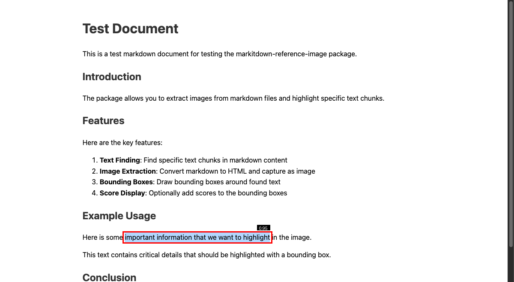
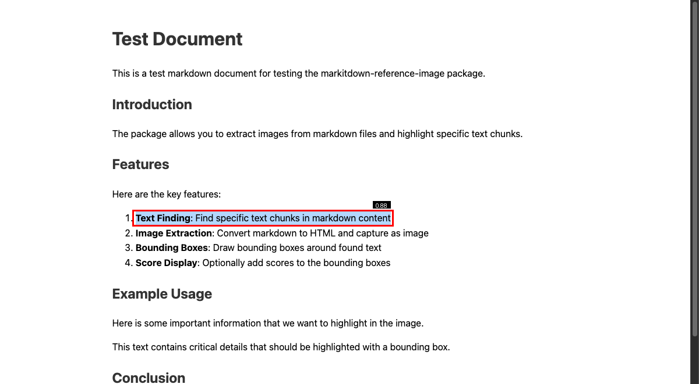
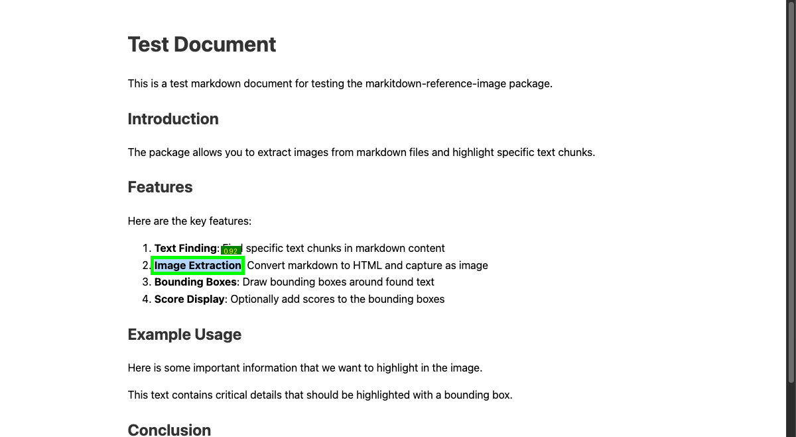
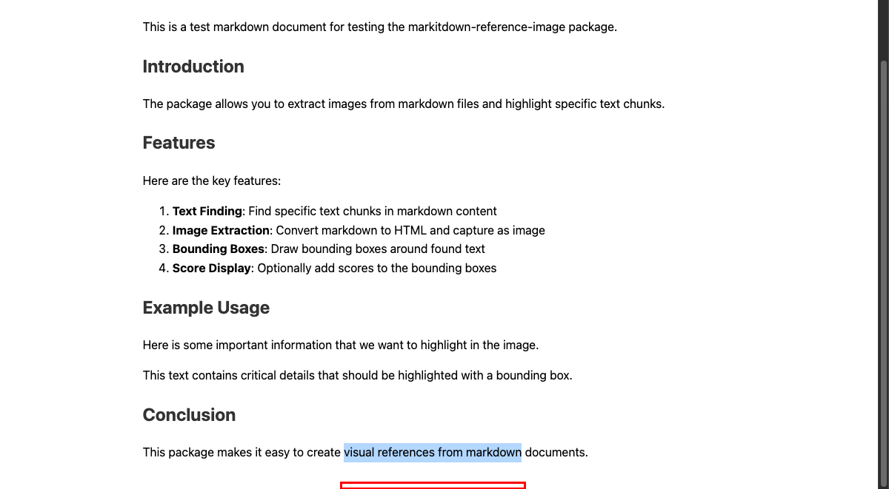

# Markitdown Reference Image

A Python package for extracting images from markdown files and highlighting specific text chunks with bounding boxes.

## Features

- Find specific text chunks in markdown content
- Convert markdown to HTML and capture as image
- Draw bounding boxes around found text chunks
- Optionally add scores to the bounding boxes
- Save processed images to specified paths or temporary files

## Installation

```bash
pip install markitdown-reference-image
```

## Usage

### Basic Usage

Extract and highlight text from a markdown file:

```python
from markitdown_reference_image import MarkitdownImageExtractor

# Initialize the extractor
extractor = MarkitdownImageExtractor()

# Extract image with highlighted text
image_path = extractor.extract_with_highlight(
    markdown_file="test_document.md",
    chunk_text="important information that we want to highlight",
    output_path="assets/example_basic.png",
    score=0.95
)

print(f"Image saved to: {image_path}")
```

**Result:**



---

### With Score Display

Add a similarity score to show retrieval confidence (great for RAG systems):

```python
image_path = extractor.extract_with_highlight(
    markdown_file="test_document.md",
    chunk_text="Text Finding: Find specific text chunks in markdown content",
    output_path="assets/example_with_score.png",
    score=0.88  # RAG similarity score
)
```

**Result:**



---

### Custom Styling

Customize colors and appearance to match your brand:

```python
image_path = extractor.extract_with_highlight(
    markdown_file="test_document.md",
    chunk_text="Image Extraction",
    output_path="assets/example_custom_styling.png",
    score=0.92,
    box_color=(0, 255, 0),        # Green box
    box_width=5,                   # Thicker border
    score_color=(255, 255, 0),     # Yellow text
    score_bg_color=(0, 128, 0)     # Dark green background
)
```

**Result:**



---

### Using Temporary Output

No output path? No problem - a temporary file is created:

```python
# Temporary file will be created automatically
image_path = extractor.extract_with_highlight(
    markdown_file="test_document.md",
    chunk_text="visual references from markdown"
    # No output_path specified - uses temporary file
)

print(f"Temporary image: {image_path}")
# Example: /tmp/tmp8x3k9m2p.png
```

**Result:**



---

### Command Line Interface

Quick testing and automation via CLI:

```bash
# Basic usage
markitdown-extract test_document.md "important information" -o output.png

# With score
markitdown-extract test_document.md "Text Finding" -o output.png -s 0.88

# Custom styling
markitdown-extract test_document.md "Image Extraction" \
  -o output.png \
  -s 0.92 \
  --box-color 0 255 0 \
  --box-width 5 \
  --score-color 255 255 0 \
  --score-bg-color 0 128 0
```

## Examples

The package includes comprehensive examples in the `markitdown_reference_image/examples/` directory:

### Quick Example Runner
```bash
python run_examples.py
```

### Individual Examples
```bash
# Basic usage examples
python -m markitdown_reference_image.examples.basic_extraction
python -m markitdown_reference_image.examples.with_score
python -m markitdown_reference_image.examples.custom_styling

# Advanced usage examples  
python -m markitdown_reference_image.examples.batch_processing
python -m markitdown_reference_image.examples.component_usage
python -m markitdown_reference_image.examples.error_handling

# Command-line examples
python -m markitdown_reference_image.examples.cli_basic
python -m markitdown_reference_image.examples.cli_with_score
python -m markitdown_reference_image.examples.cli_custom_styling
```

### Available Examples:

**Basic Usage:**
- **`basic_extraction.py`** - Basic image extraction
- **`with_score.py`** - Adding scores to bounding boxes
- **`custom_styling.py`** - Custom styling options

**Advanced Usage:**
- **`batch_processing.py`** - Batch processing multiple files
- **`component_usage.py`** - Using individual components
- **`error_handling.py`** - Proper error handling

**Command Line:**
- **`cli_basic.py`** - Basic CLI usage
- **`cli_with_score.py`** - CLI with score display
- **`cli_custom_styling.py`** - CLI with custom styling

## Development

### Setup

1. Clone the repository:
```bash
git clone https://github.com/yourusername/markitdown-reference-image.git
cd markitdown-reference-image
```

2. Install in development mode:
```bash
pip install -e .
```

3. Install development dependencies:
```bash
pip install -r requirements-dev.txt
```

### Running Tests

```bash
pytest
```

### Code Formatting

```bash
black .
```

### Linting

```bash
flake8 .
mypy .
```

## License

This project is licensed under the MIT License - see the [LICENSE](LICENSE) file for details.

## Contributing

1. Fork the repository
2. Create a feature branch
3. Make your changes
4. Add tests for your changes
5. Run the test suite
6. Submit a pull request

## Changelog

See [CHANGELOG.md](CHANGELOG.md) for a list of changes.
